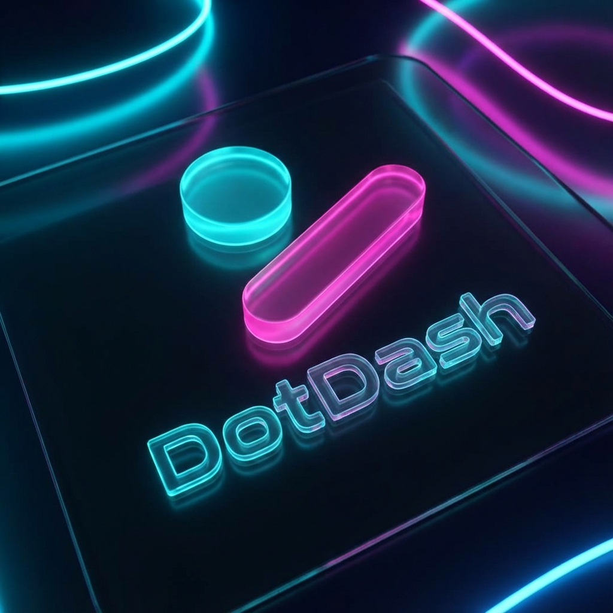

<div align="center">
  

  # DotDash

  **Master Morse Code • Gamified Learning • Real-Time Feedback**

  [](https://flutter.dev/)
  [](https://opensource.org/licenses/MIT)
</div>

---

A modern, highly-polished Morse code learning application for iOS, Android, and Web built entirely in Flutter.

Whether you're a complete beginner or looking to improve your WPM (Words Per Minute), DotDash provides a gamified experience with immersive **audio cues**, **screen flashes**, and **haptic feedback** to help you practice sending and receiving Morse code—one letter at a time, or full sentences.

---

## Features

- Send mode - tap out Morse code and get instant feedback
- Receive mode - listen to and decode Morse signals
- Adjustable speed (WPM) and tone frequency
- Audio feedback with configurable pitch
- Haptic feedback (device permitting)
- Dark and light theme

## Getting Started

### Prerequisites

- Flutter SDK `>=3.10`
- Xcode (for iOS)
- Android Studio or a connected Android device

### Running locally

```bash
git clone https://github.com/gmikx/dotdash.git
cd dotdash
flutter pub get
flutter run
```

## Platforms

| Platform | Status |
|----------|--------|
| iOS      | Supported |
| Android  | Supported |
| Web      | Supported |

## License

MIT - see [LICENSE](LICENSE).
